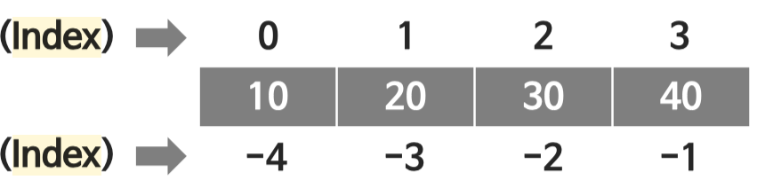

# Python Basic

### Data type (basic only)
Built-in by default, dynamically type(likes JavaScript)

 Type | Name |Note
---   | ---  | ---
Text Type |	str ||
Numeric Types |	int, float||
Sequence Types|	list, tuple, range ||
Mapping Type |	dict ||
Set Types |	set ||
Boolean Type |	bool | True, False (Capital letter on Fist)|
Binary Types |	bytes ||

<br><br>

### Data Type (Collection )
 Name | Use | Note
---   | ---  | ---
List  |  []  | ['e', 3, 4, 'test']
Dictionary | {key:value} |  {'1':'orange', '2','red'} |
Set | {} | {'orange', 'red'} |
Tuple | () | ('orange', 'red'), **Immutable** |

<br><br>


### Built in Functions
Method | Description | Note 
---  | --- | ---
range() | returns a sequence of items | range([start,]stop[,step]) |
type() | Returns the type of an object ||
sorted() | **Returns** a sorted list of the specified iterable object | x = sorted(a[, reverse=True|False])
enumerate() | Takes a collection (e.g. a tuple) and returns it as an enumerate object |for i,x in enumerate(a):| 

* Reference - [W3School](https://www.w3schools.com/python/python_ref_functions.asp)
<br><br>

### String Methods
Method | Description | Note 
---  | --- | ---
lower() | Converts a string into lower case ||
upper()	| Converts a string into upper case ||
join() | Iterate print into one sting, such as list | x = '#'.joint(['a','b','c'])
isalnum() | [a-zA-z0-9]| Return True/False
isalpha() | [a-zA-z] | | Return True/False
isnumeric() |[0-9] | Return True/False
isdigit() | any numbers, including float | Return True/False
islower() | Returns True if all characters in the string are lower case| |
find() | Searches the string for a specified value and returns the position of where it was found, if not find return -1 | string.find(value[,start ,end])
index() | same as find(), but if not find throw exception| 
count() | Returns the number of times a specified value occurs in a string| string.count(value[, start, end])
replace() | Returns a string where a specified value is replaced with a specified value | string.replace('apple', 'orange')
strip()	| Returns a trimmed white space of string |lstrip(), rstrip()|

* Reference - [W3School](https://www.w3schools.com/python/python_ref_string.asp)
<br><br>

### List Methods
Method | Description | Note 
---  | --- | ---
append() |	Adds an element at the end of the list ||
insert() | Adds an element at the specified position |list.insert(index,element)
sort() | Sorts the list | list.sort([reverse=True|False, key=myFunc)], **uses Tim sort**|
reverse() | Reverses the order of the list |list.reverse()|
count()	| Returns the number of elements with the specified value ||
pop() | Removes the last element or specified position |list.pop(), list.pop(index)|
remove() |Removes the first item with the specified value |list.remove(element)|
index()	|Returns the index of the first element with the specified value ||
clear()	| Removes all the elements from the list ||
* Reference - [W3School](https://www.w3schools.com/python/python_ref_list.asp)
<br>

**List Slicing**
```python
# list[start:End(index-1):Step]
a = [10,20,30,40]
>> a[1:3] # index 1,2 (not include 3, for (i=0: i<3: i++))
[20, 30]
>> a[::-1] # Reverse (index -1 is from last of List)
[40,30,20,10]
```
[](/img/list_indexing.png)
<br>

**List Comprehension**

```python
>>> a = []
>>> for n in range(1, 10+1):
        if n % 2 == 1:
            a.append(n * 2)
[2, 6, 10, 14, 18]

# Same as above (comprehension)
>>> [n * 2 for in range(1, 10+1) if n % 2 == 1]
[2, 6, 10, 14, 18]
```
<br><br>


### Dictionary Methods
Method | Description | Note 
---  | --- | ---
update() |Updates the dictionary with the specified key-value pairs |dic.update({key:value}) |
get() | Returns the value of the specified key | dict.get(key)
pop() |Removes the element with the specified key | dict.pop(key)
del() | Removes the element |del(dic[key])
items()	| Returns a list containing a tuple for each key value pair | dict.items()
keys() | Returns a list containing the dictionary's keys | dict.keys()
values() | Returns keys and values | dict.values()

* Reference - [W3School](https://www.w3schools.com/python/python_ref_dictionary.asp)
<br><br>


### Operation
* No short form increment/decrement operator exist in Python, such as ++i or --i
* Most of operators are same as other language

Operator | Description | Note 
---  | --- | ---
** | power | same as ^
// | quotient | 5//2 = 2, 5/2 = 2.5

<br><br>


### Loop
``` Python
# Sample 1
text = 'test'
for c in text:
    print(c)

# Sample 2
list = [1,3,5,7,9]
for i in list:
    print(i)


# Sample 3
# range([start,]stop[,step])
for x in range(6): # 0 to 5, 6 is not included

# Sample 4
for x in range(2, 30, 3): # 2 to 29, ++3
    if x <= 10:
        continue  # if x <= 10, continue back to loop
    else
        print(x)

# Sample 5
i = 0
while (i < 6):
    print(x)
    if i == 4:
        break
    i += 1

```
<br><br>

### Print()
Type | Description | Note 
---  | --- | ---
, | basic |print('name is', name)
% | old  | print('%d + %d = %d' % (a,b,a+b))
format() | common | print('{0} * {1} = {2}'.format(a, b, a*b))
f-String | Python3.6~ | print(f'{a} * {b} = {a*b}')

<br><br>


### RegEx
  * import re
  
Function | Description | Note 
---  | --- | ---
sub() | Replaces one or many matches with string | re.sub('regex', 'replace', string)


```Python
import re
s = 'Python the best!!!'

# ^ means Not, a-zA-z0-9 is range of regex, '' is what is will be replace.
# If s is not in [a-zA-Z0-9], replace with '' (same as removed)
s = re.sub('[^a-zA-z0-9]', '', s)  
print(s)
>> Pythonthebest  # Replaced all space, special chars with nothing(=Removed)
``` 